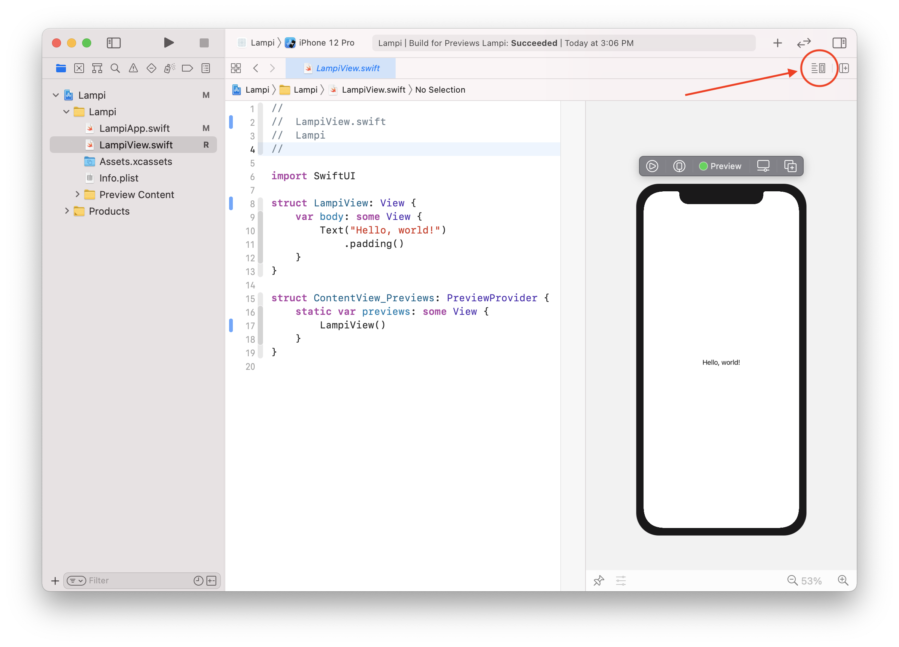
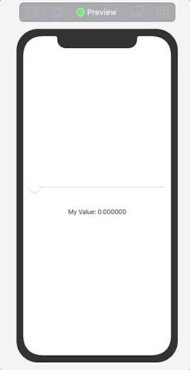

# Making a SwiftUI App

### SwiftUI Basics
SwiftUI is a framework introduced by Apple in 2019 that allows us to design the user interface in a declarative way. This in contrast to the older UIKit which follows the more traditional MVC pattern and relies on imperative functions for behavior. You'll notice similarities to the Kivy app and you'll be right at home if you're familiar with reactive programming.

You'll notice that Xcode has generated a handful of files for your new app. For this chapter we're only going to be concerned about the file that is currently named `ContentView.swift`. This is the primary view of our app.  A View in SwiftUI represents a user interface (something your application's users will "view").  This primary view will be the foundation that allows us to view and control the state of the Lampi.

For simplicity we are going to gloss over many of the capabilities of SwiftUI. Checkout Apple's [Introducing SwiftUI](https://developer.apple.com/tutorials/swiftui) if you want to get a more complete introduction.

### Rename ContentView

This this is going to be a very important part of our app, so let's give it a more specific name. Open `ContentView.swift` and right click on the `ContentView` declaration and select `Refactor > Rename...`. This will enter you into and editing mode that will allow us to change all references of `ContentView` to our new name `LampiView` - even the filename (much faster and less error prone than manually updating all references). Also, be sure to select `ContentView` reference in the comment at the top of the file. This isn't required, but it is nice to have things that match.


Build and run your project. It should run as before with no issues.  Any issues are likely due to a typo.

### Previewing Your SwiftUI View

One of the benefits of SwiftUI is that you can preview your view without needing to run the full app in a simulator or device. You do this by using the **Canvas**. If the **Canvas** isn't already open, you can click the button with lines in the upper right portion of editor and select **Canvas** (alternately, you can use the keyboard combination of `cmd-alt-enter`). You should now see a new pane next to your code that is displaying your "Hello World!" text. If you see a gray striped pane with a message of `Automatic preview updating paused` go ahead and click the `Resume` button.



This preview is powered by something called a `Preview Provider`. You may have noticed a block of generated code at the bottom of your view. This code block can be used to setup and preview your view in the different possible states when running in the app. The canvas has a `Live Preview` mode that lets you interact with your view as if it was running in the app, but currently our view doesn't any anything to interact with.

### Composing a SwiftUI View

SwiftUI views are generally composed of other more basic SwiftUI views such as images, text labels, and shapes. In order to combine these more primitive views into a complex layout we'll leverage one of the three stack views. These are: `HStack`, `VStack` and `ZStack` (Horizontal, Vertial and Z Index). You can even embed stacks within stacks depending on which direction you want to layout your views.

In order to add more views to our `LampiView`, we'll first embed the existing `Text` view in a `VStack`. Change your `LampiView` code to be this:

``` swift
struct LampiView: View {
    var body: some View {
        VStack {
            Text("Hello, world!")
                .padding()
        }
    }
}
```

You won't notice any visual change in the Canvas, but we can now add another view above or below the existing `Text` view. You can go ahead and experiment by adding another `Text` view. You may also want to switch to a `HStack` of `ZStack` to see how those work, but be sure to revert to the code above before moving on.

### Adding a Slider

While SwiftUI is powerful enough for us to build our own interactive views, Apple has provided a long [list of built-in views and controls](https://developer.apple.com/documentation/swiftui/views-and-controls) that we can use to quickly add interactivity to our view. Since our UI is mostly built of sliders, we'll add a [`Slider`](https://developer.apple.com/documentation/swiftui/slider) above our `Text` view.

Unlike our `Text` view, a [`Slider`](https://developer.apple.com/documentation/swiftui/slider) must be bound to the value that it represents. [Binding](https://developer.apple.com/documentation/swiftui/binding) creates a two way connection to the value and identifies it as the source of truth. This allows for the slider to update the value and respond accordingly if the value is updated somewhere else. (e.g., *the user is changing the lamp color using the touch screen*)

SwiftUI uses a concept called property wrappers to identify values that are to be used for this binding and for this example we are going to use the [`@State`](https://developer.apple.com/documentation/swiftui/state) property wrapper to create a value that can be used by our `Slider`. Visit [SwiftUI Property Wrappers](https://swiftuipropertywrappers.com) if you'd like to learn more about SwiftUI property wrappers.

A [`Slider`](https://developer.apple.com/documentation/swiftui/slider) requires a bound value of type `Double`, so let's set up the `LampiView` by adding the following line above the body.

```swift
@State var myValue: Double = 0.0
```

The syntax breaks down like this:

* `@State`: This property wrapper identifies that this property represents part of the state of its parent view and can be bound by child views.
* `var`: Signifying that this is a variable
* `myValue`: The variable name that you choose
* `Double`: The type of the variable
* `= 0.0`: Setting the default value to 0.0

Now that we have a `Double` value that can be bound to, we can add our slider. Add this line above our **Hello, world!** text view:

```swift
Slider(value: $myValue)
	.padding() // add padding so it looks nicer
```

When dealing with SwiftUI property wrappers, you still access the value with its variable name but we can now access the wrapper of that variable by using `$`. In this case, `$myValue` is accessing the wrapper which is of type `Binding<Double>` and it just so happens this is exactly what a `Slider` needs to be initialized.

We now have a slider, but we cannot see what the exact value is. Modify the `Text` view to display the value. Your `LampiView` should now look like this:

```swift
struct LampiView: View {
    @State var myValue: Double = 0.0

    var body: some View {
        VStack {
            Slider(value: $myValue)
                .padding()
            Text("My Value: \(myValue)")
                .padding()
        }
    }
}
```

This is all the code you need to create an interactive slider that is bound to a value and have the text label update its text every time the value changes. Because we wrapped `myValue` in the `@State` property wrapper, SwiftUI automatically detects the change and updates the view accordingly. 

SwiftUI can perform a "Live Preview" in the canvas by clicking the Play icon above the preview. Once "Live Preview" is started you can interact with your view as if it was running in a simulator or your own device.



After you've tested in the canvas, be sure to build and test it on your device before moving on.

Next up: [Swift and SwiftUI Essentials](../08.4_Swift_and_SwiftUI_Essentials/README.md)

&copy; 2015-2022 LeanDog, Inc. and Nick Barendt
