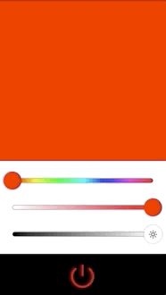
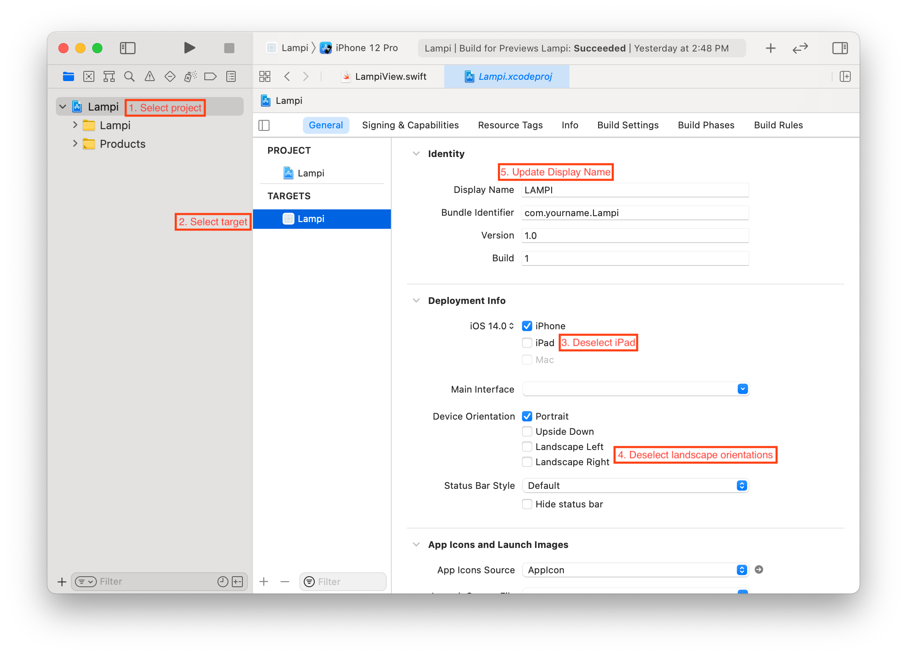
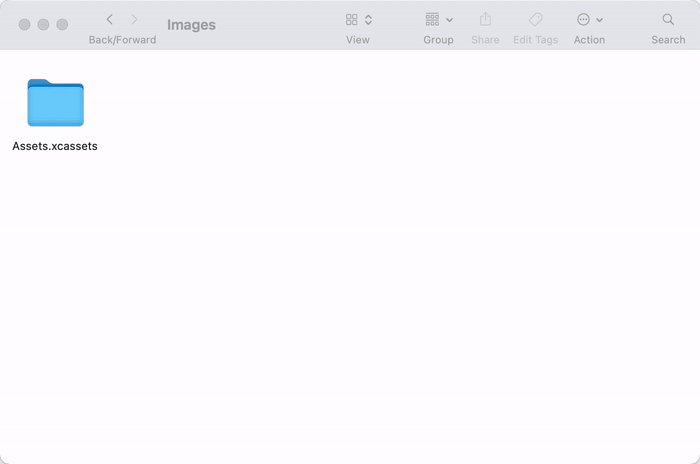
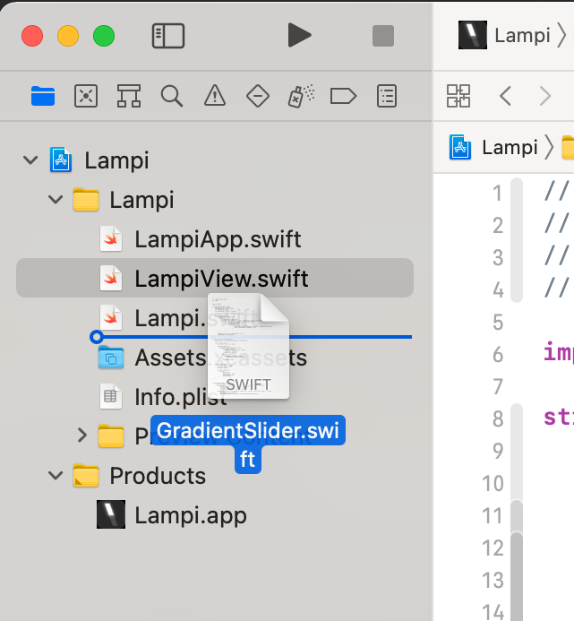
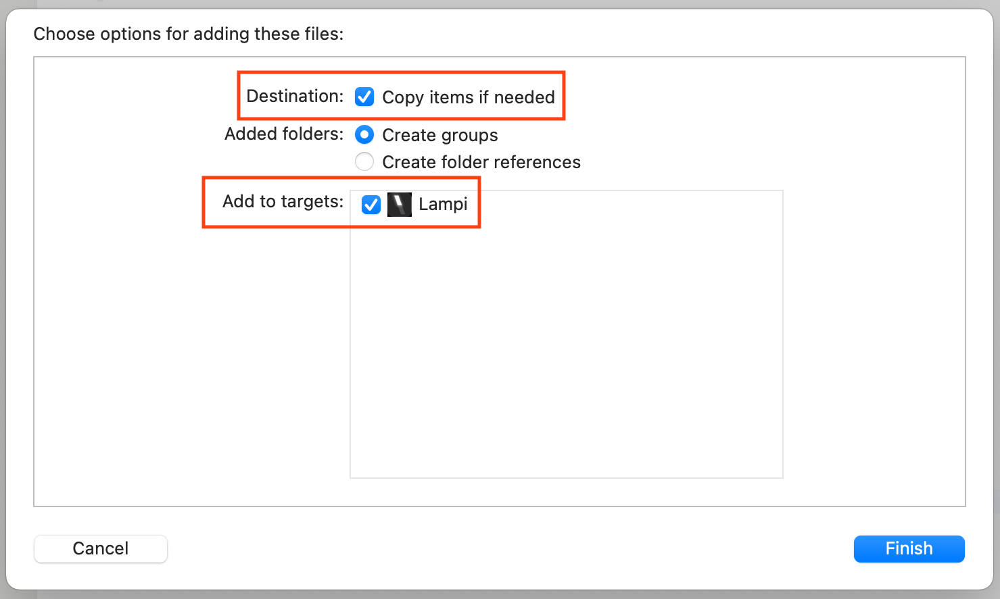

# What to Turn in

At the completion of Assignment 8, you should have an iOS application that looks and behaves like this:



Requirements:

* The application must be able to be run on an actual phone.
* The Xcode Project should reside in your repository in the 'Mobile/iOS/Lampi' directory and be named 'Lampi.xcodeproj'
* Only enable iPhone in the portrait orientation and make the app display name **LAMPI** in all caps. (see below)
    
* The application should support different screen sizes. Make sure you try different simulators or switch the simulated size in Interface Builder to make sure things scale correctly.
* Use [Rectangle](https://developer.apple.com/documentation/swiftui/rectangle) for the color block
	* Visit [https://daddycoding.com/2020/03/04/swiftui-rectangle/](https://daddycoding.com/2020/03/04/swiftui-rectangle/) for an example of how to use it
* Use [Button](https://developer.apple.com/documentation/swiftui/button) with an [Image](https://developer.apple.com/documentation/swiftui/image) inside for the Power Button
* Use [SF Symbols](https://developer.apple.com/design/human-interface-guidelines/sf-symbols/overview/) for the power and brightness icons
	* Use symbols `Image(systemName: "power")` and `Image(systemName: "sun.max")` respectively
	* Use [https://developer.apple.com/documentation/swiftui/view/imagescale(_:)](https://developer.apple.com/documentation/swiftui/view/imagescale(_:)) as a reference
* Copy over the application icons (see screen grab below for help):
	1. Open [Mobile/iOS/Images/](../../Mobile/iOS/Images/) in Finder to view **Assets.xcassets**
	2. Copy **Assets.xcassets** by selecting it and pressing `cmd-c` or by right clicking and using the menu.
	3. Open [Mobile/iOS/Lampi/Lampi](../../Mobile/iOS/Lampi/Lampi) and replace the existing **Assets.xcassets** by pasting (`cmd-v` or right click and use the menu)
	4. Open Xcode and view **Assets.xcassets** in your project to confirm the icons copied over.

	

	**NOTE:** We've included the icons for other platforms even though we aren't requiring your app to work on them at this time. 


You need to turn in the following:

1. A short (a few sentences) write up from each member of the pair summarizing what they learned completing the assignment, and one thing that surprised them (good, bad, or just surprising).  This should in **connected-devices/writeup.md** in [Markdown](https://daringfireball.net/projects/markdown/) format.  You can find a template file in **connected-devices/template\_writeup.md**
2. A Git Pull Request
3. A short video demonstrating the required behaviors emailed to the instructor and TA.  The video should be named **[assignment 3]_[LAST_NAME_1]\_[LAST_NAME_2].[video format]**.  So, for this assignment, if your pair's last names are "Smith" and "Jones" and you record a .MOV, you would email a file named ```2_smith_jones.mov``` to the instructor.
4. A live demo at the beginning of the next class - **be prepared!**

Notes:

* Each pair must have a Mac with Xcode and an iOS device between them.
* The stylized slider control already exists as `GradientSlider` in [Mobile/iOS/Controls/](../../Mobile/iOS/Controls/). See the `GradientSlider_Previews` preview provider for examples on how to use and customize the appearance. To add `GradientSlider` to you project:
	* Drag `GradientSlider.swift` from finder and drop it into your Xcode project under the same directory that holds your other code:

	
	
	* Be sure to copy the file to your project and include it in your target when prompted:

	
	
* Check out [Color](https://developer.apple.com/documentation/swiftui/color) for init methods to create color objects using hue, saturation and brightness.

&copy; 2015-2022 LeanDog, Inc. and Nick Barendt
