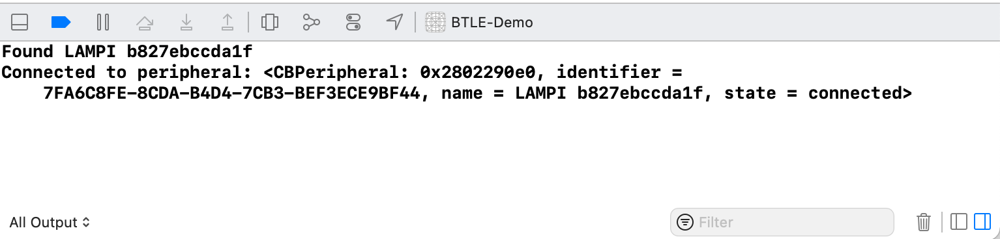

# iOS Core Bluetooth

We will build an iOS Application to work with our BTLE Service using Apple's [Core Bluetooth Framework](https://developer.apple.com/documentation/corebluetooth). Since we are building an application acting as a Central connecting to a Peripheral, [Transferring Data Between Bluetooth Low Energy Devices](https://developer.apple.com/documentation/corebluetooth/transferring_data_between_bluetooth_low_energy_devices) is especially relevant.

## Starting Point

The simple iOS application based on the one built in the Courseware for Chapter 08 with just a Slider and Label is our starting point. A working XCode project of that is here: [Mobile/iOS/BTLE-Demo/BTLE-Demo.xcodeproj](../../Mobile/iOS/BTLE-Demo/BTLE-Demo.xcodeproj). *Note that some of the file, class and variable names have changed.* Please open that project in Xcode. Be sure to select the right team to sign your build with, otherwise it will fail.

## Getting User Permission for Bluetooth

To improve user privacy and security Apple requires users to grant access to applications to access certain device features - Bluetooth is one of them.

For best iOS support, you will need to add to value's to your applications [Information Property List](https://developer.apple.com/documentation/bundleresources/information_property_list?language=objc) aka "Info.plist"

* [NSBluetoothAlwaysUsageDescription](https://developer.apple.com/documentation/bundleresources/information_property_list/nsbluetoothalwaysusagedescription?language=objc)

It should be a string, something like: 

*Allow the app to control LAMPI via Bluetooth*

## Scanning for Devices

The first thing our application will need to do is scan for BTLE devices.  To do that, we will use our first Core Bluetooth class, [`CBCentralManager`](https://developer.apple.com/reference/corebluetooth/cbcentralmanager) ("CB" for Core Bluetooth, "Central" because our app will be acting as a Central, not a Peripheral, and Manager because it will manage our BTLE interactions).

**NOTE:** Bluetooth does not work in the XCode Simulator.  You need to run the application on an iOS device to test and debug Bluetooth functionality.

For our demo app, the `BTLEObject` class is going to be where we setup and control our interactions with bluetooth. The first thing you need to do is import the `CoreBluetooth` framework below the `Foundation` import. Next, create a property to hold an instance of our `CBCentralManager`, the class we use to scan for devices:

```swift
import Foundation
import CoreBluetooth

class BTLEObject: ObservableObject {
    @Published var number: Double = 0.0

    private var bluetoothManager: CBCentralManager!
...
```

The`!` after `CBCentralManager` in our variable declaration is known as an [Implicitly Unwrapped Optional](https://docs.swift.org/swift-book/LanguageGuide/TheBasics.html#ID334). Swift uses the concept of [Optionals](https://docs.swift.org/swift-book/LanguageGuide/TheBasics.html#ID330) for situations where a value may be absent. The `!` tells the compiler to unwrap the optional value when used later on without needing to check for nil. Be careful though; a runtime error will be triggered and your app will crash if the assumption that this value exists is wrong.

In order avoid this crash, let's set the value in our `init` method. Add an `init` method under our private bluetooth manager property.

```swift
init() {
    self.bluetoothManager = CBCentralManager(delegate: self, queue: nil)
}
```
At this point you should get a nice, completely ambiguous build error: **Type expression is ambiguous without more context** in Xcode:


Part of the reason this error is so ambiguous is because we actually have a few different problems with our `init()` method, but the biggest one is that `BTLEObject` does not conform to [CBCentralManagerDelegate](https://developer.apple.com/library/ios/documentation/CoreBluetooth/Reference/CBCentralManagerDelegate_Protocol/) yet we've assigned self to be the delegate of our new mananger. 

**Core Bluetooth** was introduced in 2011 and due to its age sometimes uses older patterns that were more common at that time. One of these is the [delegate pattern](https://developer.apple.com/library/content/documentation/General/Conceptual/CocoaEncyclopedia/DelegatesandDataSources/DelegatesandDataSources.html) which is heavily used in many iOS frameworks. In our case, our `BTLEObject` will be the delegate that CBCentralManager will call methods on when it wants to notify us of something.

To resolve the error, we need to conform to the `CBCentralManagerDelegate` protocol which has two primary requirements: 

1. Conform to `NSObjectProtocol`
2. Implement `func centralManager(CBCentralManager, didConnect: CBPeripheral)`

We can easily conform to `NSObjectProtocol` by having `BLEObject` inherit from `NSObject`. `NSObject` is a relic from when Apple predominately developed it's frameworks in Objective-C. Add the `NSObject` inheritance to `BLEObject` and update the `init()` method:

```swift
class BTLEObject: NSObject, ObservableObject {
    @Published var number: Double = 0.0

    private var bluetoothManager: CBCentralManager!

    override init() {
        super.init()
        self.bluetoothManager = CBCentralManager(delegate: self,
                                                 queue: nil)
    }
}
```

The `init()` method needs to be updated because we're now inheriting from a concrete class that already defines an `init()` method and we're overriding that to set our `bluetoothManager`. We add the `super.init()` because without it, the object will not be initialized before we set it as the delegate of the `bluetoothManager`. So technically, between lines 7 and 8, self has been initialized but doesn't have a `bluetoothManager` - but this is the only place the code that this would be true. This is why we need to use the implicit unwrapping described above. The final parameter to initialize a `CBCentralManager` is `queue` which is left `nil`- this defaults to using the main queue (i.e., the UI thread).

We now need to satisfy the second requirement of `CBCentralManagerDelegate`, which is to implement the required method. We can do so by using what is called an extension. Swift extensions are great ways to separate concerns and add additional protocol conformity. The entire `BTLEObject.swift` file should look like below and the project should now build.

```swift
import Foundation
import CoreBluetooth

class BTLEObject: NSObject, ObservableObject {
    @Published var number: Double = 0.0

    private var bluetoothManager: CBCentralManager!

    override init() {
        super.init()
        bluetoothManager = CBCentralManager(delegate: self,
                                            queue: nil)
    }
}

extension BTLEObject: CBCentralManagerDelegate {
    func centralManagerDidUpdateState(_ central: CBCentralManager) {
        print("Bluetooth Manager State: \(central.state)")
    }
}
```

We are going to be scanning for a [CBPeripheral](https://developer.apple.com/library/ios/documentation/CoreBluetooth/Reference/CBPeripheral_Class/index.html#//apple_ref/doc/c_ref/CBPeripheral) that matches our device, so let's create private variable to store it when we find it. Add this under the bluetooth manager in the main class definition:

```swift
class BTLEObject: NSObject, ObservableObject {
    @Published var number: Double = 0.0

    private var bluetoothManager: CBCentralManager!
    private var devicePeripheral: CBPeripheral? // <- ADD THIS LINE

    override init() {
        super.init()
        bluetoothManager = CBCentralManager(delegate: self,
                                            queue: nil)
    }
}
```

For this variable, we are not going to use implicit unwrapping `!` since there are legitimate reasons that we might not find the Lampi peripheral. (eg: it could be out of range or the bluetooth service hasn't started). Instead we are explicitly marking the value as optional with a `?`. This informs the compiler that the value may or may not exist at any point. We'll touch on this further in upcoming sections.

Now in the **CBCentralManagerDelegate Extension**, implement the following methods from the [CBCentralManagerDelegate](https://developer.apple.com/library/ios/documentation/CoreBluetooth/Reference/CBCentralManagerDelegate_Protocol/) protocol:

```swift
extension BTLEObject: CBCentralManagerDelegate {
    private static let DEVICE_NAME = {{YOUR BLUETOOTH DEVICE NAME}}
    private static let OUR_SERVICE_UUID = "7a4bbfe6-999f-4717-b63a-066e06971f59"

    func centralManagerDidUpdateState(_ central: CBCentralManager) {
        if central.state == .poweredOn {
            let services = [CBUUID(string:BTLEObject.OUR_SERVICE_UUID)]
            bluetoothManager.scanForPeripherals(withServices: services)
        }
    }

    func centralManager(_ central: CBCentralManager,
                        didDiscover peripheral: CBPeripheral,
                        advertisementData: [String : Any],
                        rssi RSSI: NSNumber) {
        if peripheral.name == BTLEObject.DEVICE_NAME {
            print("Found \(BTLEObject.DEVICE_NAME)")

            devicePeripheral = peripheral

            bluetoothManager.stopScan()
            bluetoothManager.connect(peripheral)
        }
    }

    func centralManager(_ central: CBCentralManager, didConnect peripheral: CBPeripheral) {
        print("Connected to peripheral: \(peripheral)")
    }

    func centralManager(_ central: CBCentralManager, didDisconnectPeripheral peripheral: CBPeripheral, error: Error?) {
        print("Disconnected from peripheral: \(peripheral)")
    }
}	
```

You see that we have two delegate methods for peripheral connection and disconnection. Let's track this state by adding a variable below our number variable:

```swift
class BTLEObject: ObservableObject {
	@Published var number: Double = 0.0
	@Published var isConnected: Bool = false
	...
```

And update the connection and disconnection delegate methods:

```swift
	...
	func centralManager(_ central: CBCentralManager, didConnect peripheral: CBPeripheral) {
		print("Connected to peripheral: \(peripheral)")
		isConnected = true
	}

	func centralManager(_ central: CBCentralManager, didDisconnectPeripheral peripheral: CBPeripheral, error: Error?) {
		print("Disconnected from peripheral: \(peripheral)")
		isConnected = false
	}
	...
```

**NOTE:** Make sure to update **DEVICE_NAME** - should make it something unique to avoid confusion with other students' devices.  The value must be exactly the same in your iOS application as in your `bleno` NodeJS application!  

**NOTE:** if you change your device name, it is possible [iOS's Bluetooth Cache will hold onto the values](https://forums.developer.apple.com/thread/19381) and clearing the cache apparently requires a device reset.

**NOTE:** in a real-world application, we would likely discover all devices advertising the Service UUID of interest and allow the user to select the particular device - we are skipping that complexity and hard coding a device name.

So when the CBCentralManager moves to a **powered on** state, it will start attempting to scan for devices that advertise the Lamp service and match the given device name. 

With the lamp powered on and your `bleno` bluetooth service running, run the iOS app and observe the console.



Your iOS application has successfully discovered and connected to your service.

Next up: [09.6 Write a Characteristic Value](../09.6_Write_a_Characteristic_Value/README.md)

&copy; 2015-2022 LeanDog, Inc. and Nick Barendt
