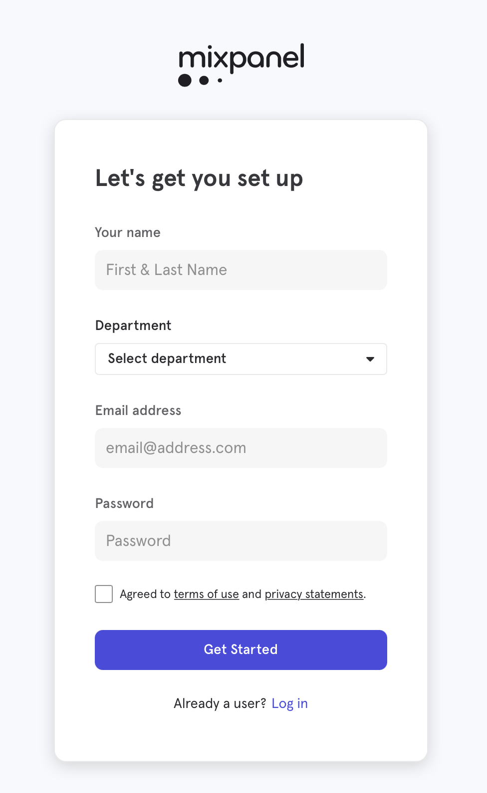
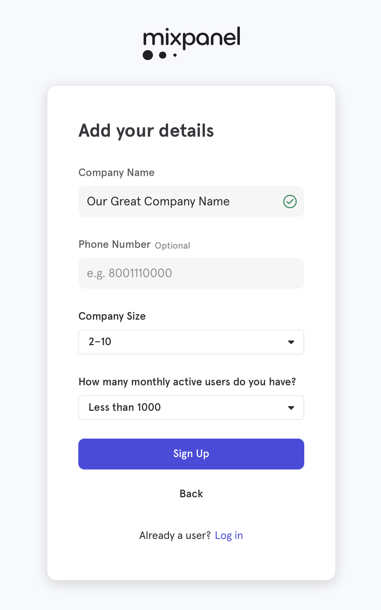
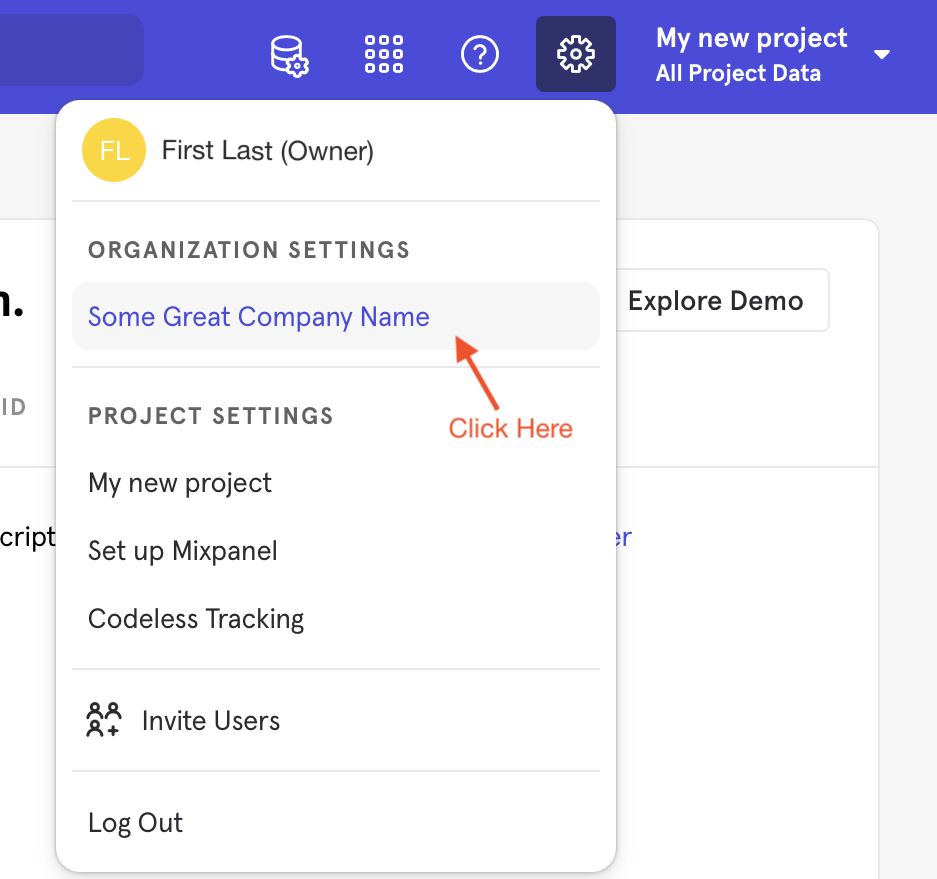
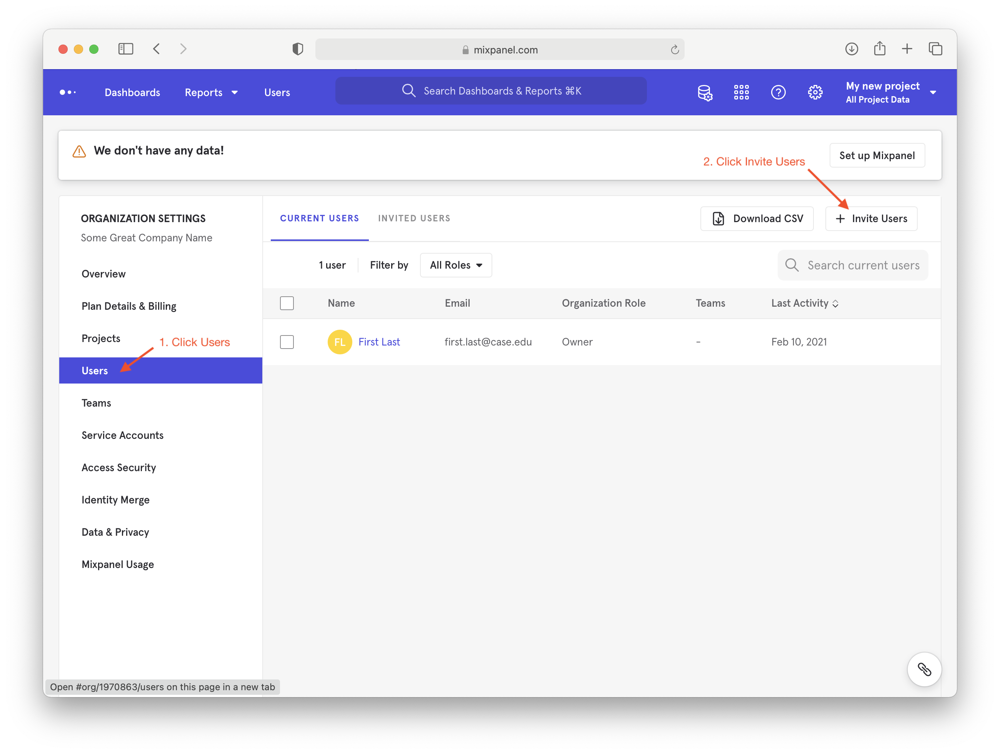
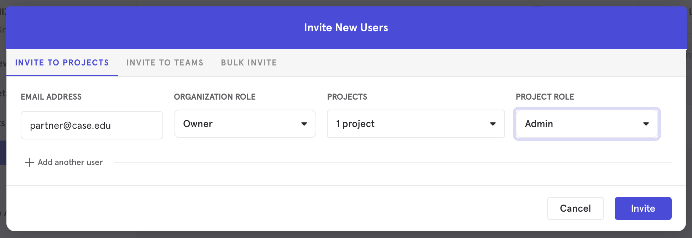

# Introduction to Analytics

Analytics is the process of instrumenting product(s) and using the resulting data to discover insights about the product(s), customers and users, and product usage. Time and focus are the most valuable assets of a product delivery team. By collecting analytics, the team can identify areas of the product that would be most valuable to improve or fix. The most valuable areas are the ones that the team should focus on. 

The general process for collecting Analytics is:

1. Identify Goals (what are we trying to learn?)
2. Capture Events (to a database)
3. Query & Analyze Data
4. Visualize Event Data
5. Apply models to event data (e.g., pipeline)
6. Evaluate Data and Goals to make Decisions
7. Repeat...

This is a never-ending cycle - there are always aspects of your product or system that can be improved.  Analytics is a process and discipline, not an event.

The implied last step is to discover insights and then translate those insights into actions (e.g., improving user experience to improve sales funnel conversion).

## Identifying Goals

Setting goals for a new product like LAMPI can be more difficult than it is for an existing one. Existing products can have goals like "Increase the user base by 10%" or "Decrease the average time a user takes to complete signup by 25 seconds". For a new product without any historical data we need to focus our initial goals on learning about our users, how successful the users are with the existing system and the general state of our system.

For the purposes of this chapter we are going layout the following areas of focus to learn about:

1. How are our users interacting with the system?
2. How successful are users at getting started?
3. What is the state and stability of our system?

## Capturing Data

Deciding what data to capture can be tricky - data that might not seem relevant right now often needs to be captured so that you have it in the future "just in case". Be careful not to spend your valuable time and focus on all of the things you that *can* capture and lose sight of the data points that help you with your goals. Thankfully most analytics libraries will help us automatically capture data points that are not relevant now but could be in the future. These data points include geography, browser, operating system, referrer page, session time etc.

Analytics for Web sites and mobile applications are pretty well developed at this point - there are many tools to choose from.

Connected Devices raise the complexity bar for analytics (and business overall).  Integrating Web and Mobile analytics data and analysis is complicated - adding a large number of embedded devices, connected over WiFi, Bluetooth, etc., integrating data capture into those products, accessing the captured data, and integrating that data with your Web and Mobile data for insights requires lots of planning.

While you can build your own analytics system, and store event data in your own database, query it, etc., the quality and number of analytics platforms available make it hard to justify building your own solution.  The platforms are designed for massive, large scale event data ingestion, and back-ends optimized for rapid querying and analysis, as well as support for multiple languages (JavaScript, Ruby, Python, iOS, etc.) and platforms (browsers, iOS, Android, etc.).

## Analysis

An infinite number of queries and analysis can be performed on Analytics data, depending on the organization, product, goals, etc.  Nearly all, though, are based on some segment of time (e.g., "today", "the last 24 hours", "the last week", etc.) or comparing data for different time frames (e.g., "last week versus the previous week" or "this year to date, versus last year to the same date").

A very common analysis is "Page Views" - how many HTML pages did we serve up in the last hour, day, week, etc.  "Unique Visitors" is also common - how many different people visited our site during a particular time frame.

### Funnels

A very common analysis model is a "funnel" or flow, typically broken down into discrete user actions/steps, such as:

1. Landing Page
1. Search for a Product
1. Add Product to Shopping Cart
1. Start Checkout
1. Complete Checkout (Purchase Something)

Obviously, if we are an online merchant, we drive revenue primarily when people complete the last step "Complete Checkout" and we want the largest number of people as possible hitting the "top" of the funnel ("Landing Page") and the largest percentage of those people as possible to buy something ("Complete Checkout") but invariably people "fall-out" at various steps.  Sometimes it is because they decide the product is not worth the price.  Other times, though, it is because they just get confused on the site, or give up because it is too complicated.  Funnel analysis is how we monitor the flow and seek to improve "conversion rates".  

Funnels are not only useful for e-commerce, but for any critical flow.  [A/B Testing](https://en.wikipedia.org/wiki/A/B_testing) is frequently performed within the context of a funnel analysis - at a particular stage of the funnel that the team is working to improve, two (or more) variants of the page ("A" variant, "B" variant, etc.) are created to test hypotheses of what might improve conversion to the next stage.  The platform randomly assigns users to one group or the other.  The analytics results can then help the team understand if "A" or "B" worked better (or, depressingly frequently) that they performed the same. 

## Analytics Platforms

There are a huge number of analytics platforms we could choose from, noting that we have a couple requirements to fulfill:

* For the purpose of this class, there needs to be an offering with a free tier.
* Must have Python and Objective-C clients.
* Cannot be exclusively focused on web or mobile.  We need a platform that can capture events from all of our user interfaces and systems.

Here are some other potential platforms, some more specialized than others:

* [Matomo](https://matomo.org) *formally Piwik*
* [Google Analytics](https://www.google.com/analytics/)
* [Splunk](http://www.splunk.com)

## Getting Started with Mixpanel

Given the course needs, we will be working with [Mixpanel](https://mixpanel.com). Mixpanel is a general purpose analytics solution with support for a [wide range of platforms and languages](https://developer.mixpanel.com/docs#sdks).

### Signing Up

One of you need to first [register for a free account at Mixpanel](https://mixpanel.com/register/). Feel free to set your department as "Other"

 
 
Set your **Company Name** to something that applies to both of you. Finally, set the Company Size and Active Users to *2-10* and *Less than 1000* respectively. 

Click *Sign Up*.

#### Inviting your partner(s)
Mixpanel will create a project called *My new project* under the company name that you provided. We need to invite the other team member so they can analyze the data and create visualizations.

In open your *Organization Settings* with the gear icon in the upper right corner of the screen and click your company name.

Open up the *Users* settings for the organization and click *Invite Users*.

Enter your partner's email and give them the *Organization Role* of *Owner*, select all projects and give them the *Project Role* of *Admin*. Follow the instructions on the resulting email to accept the invite. 

Next up: [10.2 Logging an Analytics Event](../10.2_Logging_an_Analytics_Event/README.md)

&copy; 2015-2022 LeanDog, Inc. and Nick Barendt
