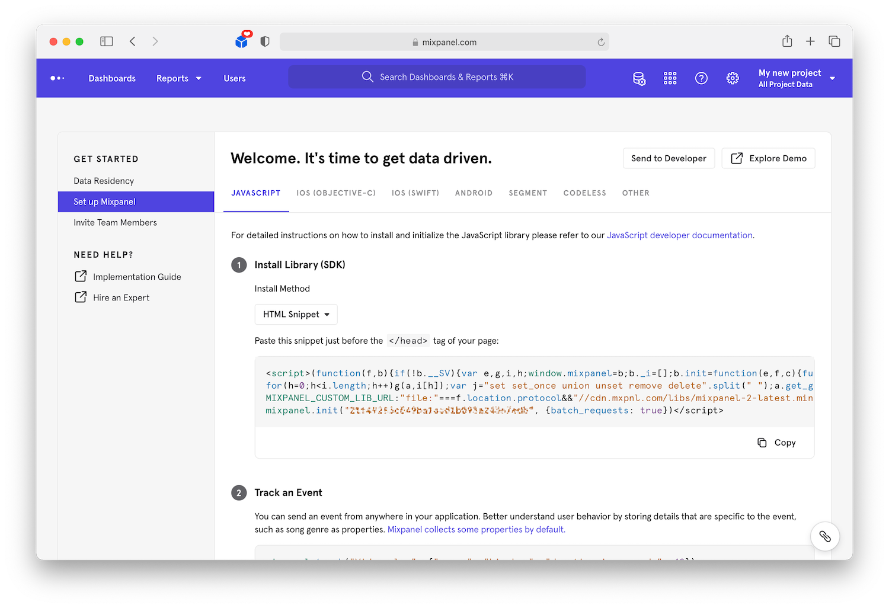
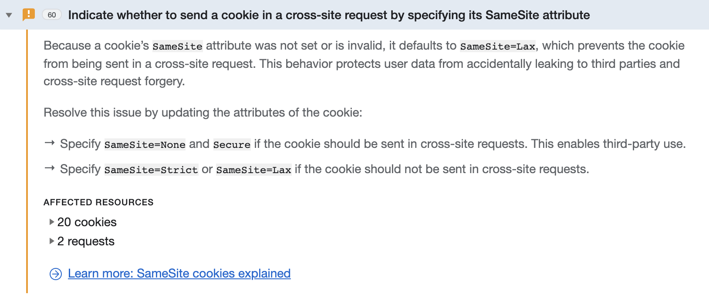

# Web Analytics 

Web analytics are pretty mature at this point, and pretty straight-forward to integrate into your site. While many analytics libraries can autotrack web events, Mixpanel takes a more deliberate approach that requires you explicitly track specific events. Mixpanel even started the [retirement of Autotrack](https://help.mixpanel.com/hc/en-us/articles/115004600343-Autotrack-Retirement) in 2019 and posted a [blog why](https://mixpanel.com/blog/codeless-analytics-problems/). While Mixpanel does not automatically track events, it does still help us track data points like current url, referrer, sessions, browser versions, OS, etc.

In [Mixpanel](https://mixpanel.com) open **Settings** and select **Set up Mixpanel** to view setup instructions for number of SDKs:



Copy the HTML snippet and paste it into the `<head>` tag of [base.html](../../Web/lampisite/lampi/templates/lampi/base.html). Because we are hosting on EC2 under a subdomain of amazonaws.com we need adjust the snippet to disallow cookies being applied across the subdomain. 

Since we'll want to distinguish web interface events from events on other interfaces, we should [register](https://developer.mixpanel.com/docs/javascript-full-api-reference#mixpanelregister) the `interface` super property with a value of `web`. A super property will apply to all events that are triggered by the library.

Your snippet should now look similar to this:

```js
<script>(function(f,b){if(!b.__SV){var e,g,i,h;window.mixpanel=b;b._i=[];b.init=function(e,f,c){function g(a,d){var b=d.split(".");2==b.length&&(a=a[b[0]],d=b[1]);a[d]=function(){a.push([d].concat(Array.prototype.slice.call(arguments,0)))}}var a=b;"undefined"!==typeof c?a=b[c]=[]:c="mixpanel";a.people=a.people||[];a.toString=function(a){var d="mixpanel";"mixpanel"!==c&&(d+="."+c);a||(d+=" (stub)");return d};a.people.toString=function(){return a.toString(1)+".people (stub)"};i="disable time_event track track_pageview track_links track_forms track_with_groups add_group set_group remove_group register register_once alias unregister identify name_tag set_config reset opt_in_tracking opt_out_tracking has_opted_in_tracking has_opted_out_tracking clear_opt_in_out_tracking start_batch_senders people.set people.set_once people.unset people.increment people.append people.union people.track_charge people.clear_charges people.delete_user people.remove".split(" ");
for(h=0;h<i.length;h++)g(a,i[h]);var j="set set_once union unset remove delete".split(" ");a.get_group=function(){function b(c){d[c]=function(){call2_args=arguments;call2=[c].concat(Array.prototype.slice.call(call2_args,0));a.push([e,call2])}}for(var d={},e=["get_group"].concat(Array.prototype.slice.call(arguments,0)),c=0;c<j.length;c++)b(j[c]);return d};b._i.push([e,f,c])};b.__SV=1.2;e=f.createElement("script");e.type="text/javascript";e.async=!0;e.src="undefined"!==typeof MIXPANEL_CUSTOM_LIB_URL?
MIXPANEL_CUSTOM_LIB_URL:"file:"===f.location.protocol&&"//cdn.mxpnl.com/libs/mixpanel-2-latest.min.js".match(/^\/\//)?"https://cdn.mxpnl.com/libs/mixpanel-2-latest.min.js":"//cdn.mxpnl.com/libs/mixpanel-2-latest.min.js";g=f.getElementsByTagName("script")[0];g.parentNode.insertBefore(e,g)}})(document,window.mixpanel||[]);
    mixpanel.init("CHANGE_MIXPANEL_TOKEN", {batch_requests: true, cross_subdomain_cookie: false});
    // Add the cross_subdomain_cookie: false above
    
    mixpanel.register({"interface": "web"}); // <- Register interface super property
</script>
```

Read Mixpanel's post: [Track Across Hosted Subdomains](https://help.mixpanel.com/hc/en-us/articles/115004507486-Mixpanel-and-herokuapp-com-subdomains-and-other-common-top-level-domains-) for more information about the cross subdomain cookie. 

Finally we'll want to track when each page is loaded and viewed. While we could make this a generic and segment by URL in the Mixpanel Reports, it would be nice to have custom events for our most important pages. Add the tracking code to the bottom of the HTML `body`

```html
...
<body>
    <div id="outer-pane" class="centered-root">
         <div>
            
               <a href="">Logout</a>
               
                   <a href="">Admin</a>
               
            
               <a href="">Login</a>
            
        </div>
        
        <p>Content Goes Here.</p>
        
    </div>
    <script>
        mixpanel.track("Page View", {"event_type": "pageview"});
    </script>
</body>
...
```

And add the following blocks to the bottom each template page to customize the tracking of each page view:

**[addlampi.html](../../Web/lampisite/lampi/templates/lampi/addlampi.html)**

`Add LAMPI`

**[detail.html](../../Web/lampisite/lampi/templates/lampi/detail.html)**

`LAMPI Detail`

**[index.html](../../Web/lampisite/lampi/templates/lampi/index.html)**

`LAMPI List`

With the above tracking code, Mixpanel will record individual events for the Index, Detail and Add pages. It also will default to a more generic **Page View** event if the template does not include the `page_event` block. With these events, Mixpanel will also track additional default properties as documented in [Default Properties Collected by Mixpanel](https://help.mixpanel.com/hc/en-us/articles/115004613766).

> **NOTE:** If you see a cookie warning like the one below. This is due to a conflict with your Mixpanel login cookie and the analytics cooking being set. You can ignore this issue, but if you want to get rid of it use a private browser tab or another browser.
> 
> 
> See this [GitHub Issue](https://github.com/mixpanel/mixpanel-js/issues/224) for more context.

Next up: [10.4 iOS Analytics](../10.4_iOS_Analytics/README.md)

&copy; 2015-2022 LeanDog, Inc. and Nick Barendt
