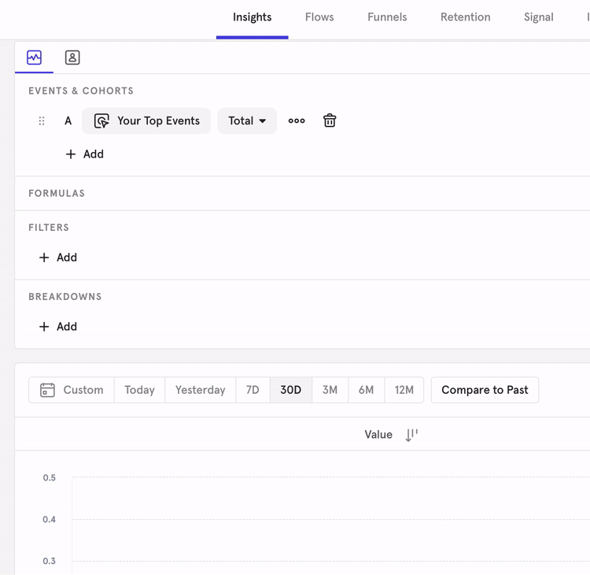
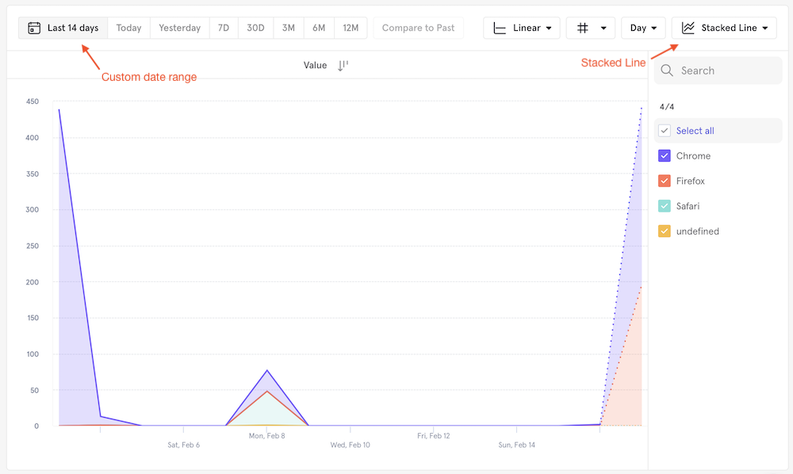
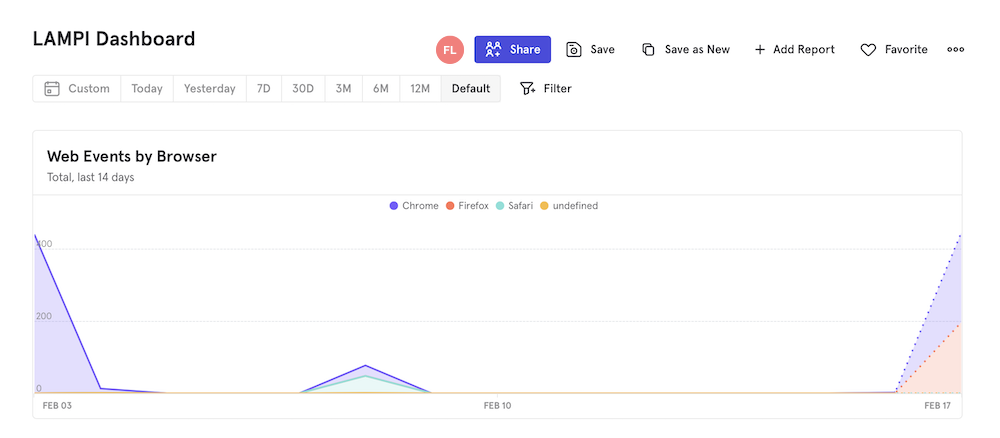

# Mixpanel Dashboard

Now that we are capturing a number of web and mobile events, we need to be able to visualize and analyze the data. One of the more standard ways of visualizing your analytics data is through a live dashboard.  The contents of the dashboard will vary by team and product, and even by where the product is at in its lifecycle (e.g., a startup might need to be focused on proving customer engagement with a new product to validate product-market fit, while a more established organization or product might need to be focused on improving a particular funnel conversion or monitoring product usage).  

Mixpanel provides a number of tools and concepts that will allows us to analyze the different events that are being captured. Review Mixpanel's [Analysis Overview](https://help.mixpanel.com/hc/en-us/articles/360049450392-Analysis-Overview) guide for an overview of necessary concepts and analysis operations. 

We will primarily focus on building a single [Dashboard](https://help.mixpanel.com/hc/en-us/articles/115004565746-Dashboard-Overview-) that is composed of 5 different [Reports](https://help.mixpanel.com/hc/en-us/articles/360049450392-Analysis-Overview#report).

> **NOTE:** The free version of Mixpanel allows for only 5 saved reports. Most enterprise dashboards would likely include more than 5.

## Report Web Events by Browser

To help us answer our first question of **How are our users interacting with the system?** we're going to make an [Insight Report](https://help.mixpanel.com/hc/en-us/articles/360001333826) that displays all **web** events and breaks them down by browser type. 

1. While logged into [Mixpanel](https://mixpanel.com), create a new report by expanding the **Reports** menu in the top toolbar and selecting **Insights**
2. Select **All Events** as the base of our report
3. Filter the events by **interface** equaling **web**
4. Break down the events by **Browser**

    

5. Adjust the date range to a **Custom Fixed** range of the last 14 days
6. Switch from a **Line** to a **Stacked Line** chart

    You should now have a graph that looks similar to this:

    
    
7. Scroll back to the top and click save. Give this report the title **Web Events by Browser** and a description if you'd like. Click the **Save** button.

## Creating the LAMPI Dashboard

Now that we have a report we need to add it to a dashboard. In the top toolbar, click **Dashboards**. We haven't created a dashboard yet, so you'll see an empty welcome screen - click **Get Started** or the **+** button to create a dashboard. Name the new dashboard **LAMPI Dashboard** and save.

Next, add the **Web Events by Browser** report you just created. Feel free to resize the new pane so it takes up more of the horizontal space. Finally be sure to save the dashboard after you added the report.

Your new dashboard should resemble:

Next up: [10.6 Assignment](../10.6_Assignment/README.md)

&copy; 2015-2022 LeanDog, Inc. and Nick Barendt
