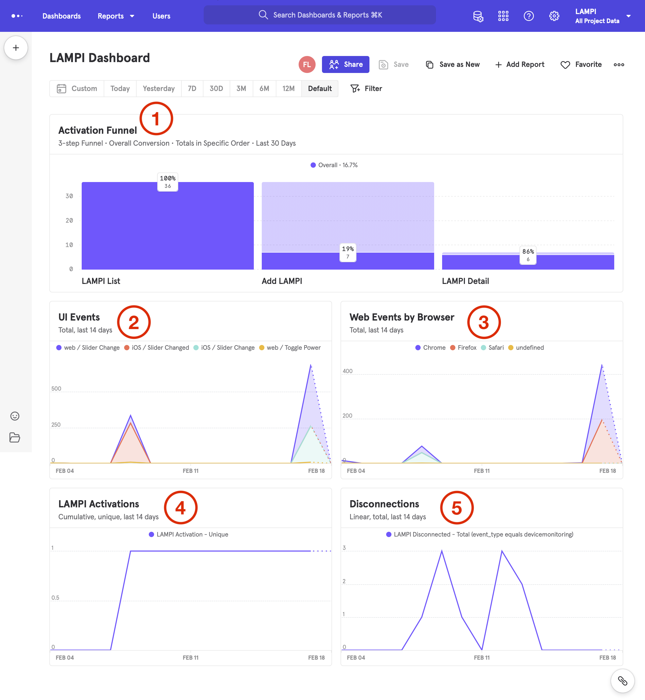

# Assignment

For this Assignment you will be instrumenting:

* Web Pages
* iOS
* `mqtt-daemon`

and building the following Dashboard:



## Dashboard Charts

Please refer to the numbered view of the dashboard here for what should appear in each chart cell:

 

### Report Specifications

#### 1. Activation Funnel
* **TYPE:** Funnels
* **STEPS:**
	* LAMPI List
	* Add LAMPI
	* LAMPI Detail
* **CONVERSION CRITERIA:**
	* **Totals** in **specific order** who converted within **30 days** holding **+ Property** constant
		* *Don't add a value for **Property***
* **TIME FRAME:** 30D
* **VIEW:** Funnel Steps

#### 2. UI Events
* **TYPE:** Insights
* **EVENTS AND COHORTS:**
	* **All Events** **Total** filtered where **event_type = ui**
* **BREAKDOWNS:**
	* **interface**
	* **Event Name**
* **TIME FRAME:** Custom Last 14 days
* **VIEW:** Stacked Line

#### 3. Web Events by Browser *(built in last section)*
* **TYPE:** Insights
* **EVENTS AND COHORTS:**
	* **All Events** **Total** filtered where **interface = web**
* **BREAKDOWNS:**
	* **Browser**
* **TIME FRAME:** Custom Last 14 days
* **VIEW:** Stacked Line

#### 4. LAMPI Activations
* **TYPE:** Insights
* **EVENTS AND COHORTS:**
	* **LAMPI Activation** **Unique**
* **BREAKDOWNS:**
	* None
* **TIME FRAME:** Custom Last 14 days
* **VIEW:** Line
	* Change from a **Linear** to a **Cumulative** chart

#### 5. Disconnections
* **TYPE:** Insights
* **EVENTS AND COHORTS:**
	* **LAMPI Disconnected** **Total** filtered where **event_type = device monitoring**
* **BREAKDOWNS:**
	* None
* **TIME FRAME:** Custom Last 14 days
* **VIEW:** Line Line

Don't forget to save each report as you make changes. All saved changes will apply if the report is added to the dashboard already.

**NOTE:  Your dashboard should generally look like the images here, but, it is okay if there are small differences in your chart colors, gaps between "tiles" in the dashboard, etc.**  

## Instrumentation

You will need to add instrumentation (event recording) to the Web, iOS, and MQTT (backend) systems.

## Web

There are two parts to this:

1. The page view events that we setup earlier.
1. Detailed tracking of UI events in `lampi.js`
	* On/Off Button
		* **Event Name:** Toggle Power
		* **event_type:** ui
		* **isOn:** current on/off state
	* Sliders
		* **Event Name:** Slider Change
		* **event_type:** ui
		* **slider:** ID of the slider ("hue-slider", "saturation-slider" or "brightness-slider")
		* **value:** The current value of the slider between 0 and 1

Do not worry about the volume of analytics events at this point (e.g., fine if many events are generated as a slider is moved).  Do not worry about instrumenting the Dashboard page.

## iOS

Instrument the LAMPI iOS application with UI events for sliders and the button. Events should have the `event_type` = `ui` and `interface` = `iOS`. The names and properties of the events should match their Web counterparts.

Again, do not worry about the volume of analytics events at this point.

## `mqtt-daemon`

The `mqtt-daemon` should track:

* Device Activations (as in the Courseware) with the `activations` event_type.
* Device State (as in the Courseware) with the `devicestate` event_type.
* Device Broker Bridge Connections and Disconnection with the `devicemonitoring` event_type

## Liveness

Refreshing the Dashboard should demonstrate that new events are being recorded and are showing up in the reports (e.g., visiting a page on your site, using the iOS application to control the lamp, etc.).

## What to Turn in 

You need to turn in the following:

1. A short (a few sentences) write up from each member of the pair summarizing what they learned completing the assignment, and one thing that surprised them (good, bad, or just surprising).  This should in **connected-devices/writeup.md** in [Markdown](https://daringfireball.net/projects/markdown/) format.  You can find a template file in **connected-devices/template\_writeup.md**
2. A Git Pull Request
3. A short video demonstrating the required behaviors emailed to the instructor and TA.  The video should be named **[assignment 3]_[LAST_NAME_1]\_[LAST_NAME_2].[video format]**.  So, for this assignment, if your pair's last names are "Smith" and "Jones" and you record a .MOV, you would email a file named ```2_smith_jones.mov``` to the instructor.
4. A live demo at the beginning of the next class - **be prepared!**

Notes:

* Each pair must have a Mac with Xcode and an iOS device between them.


&copy; 2015-2022 LeanDog, Inc. and Nick Barendt
