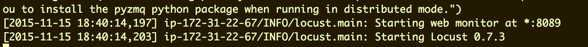
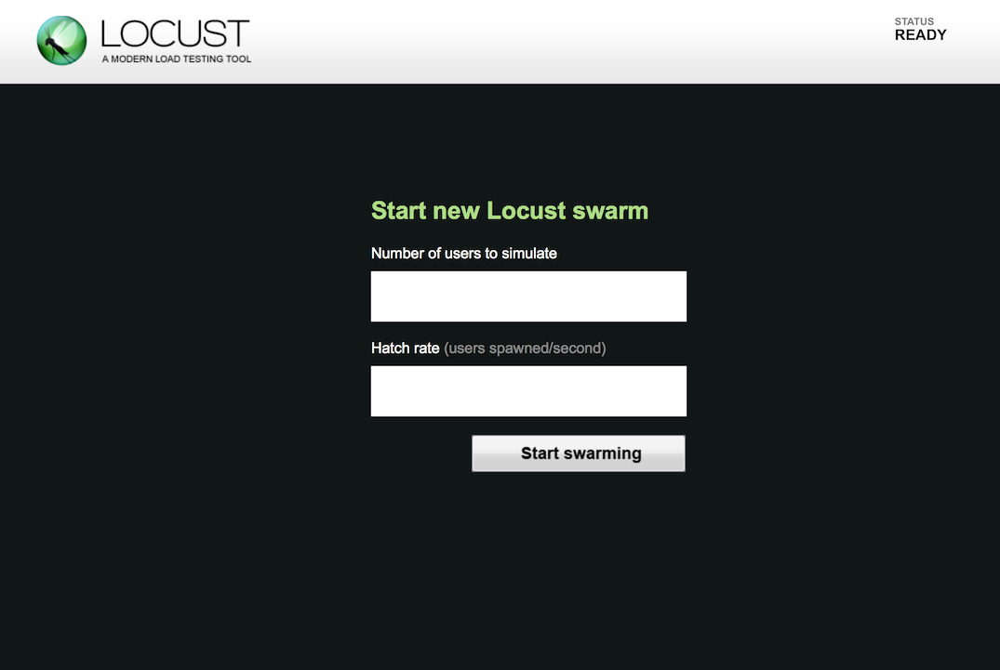
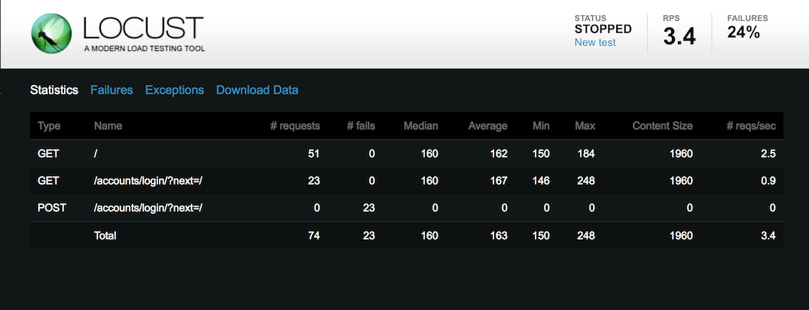
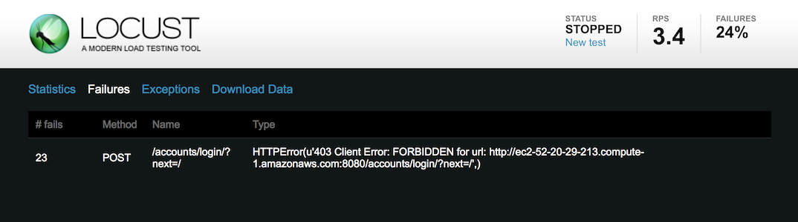
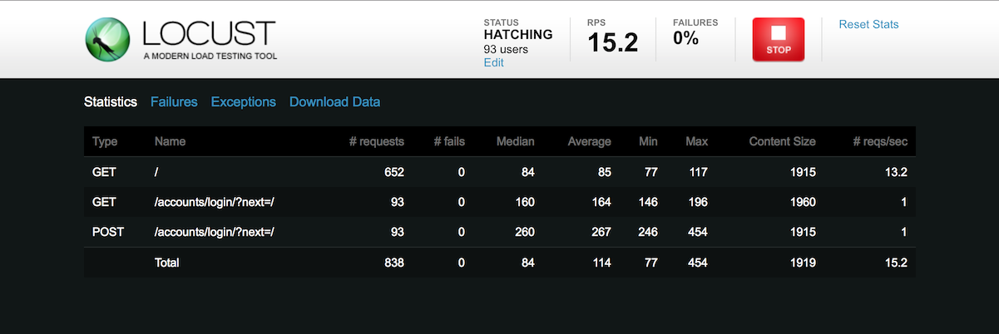
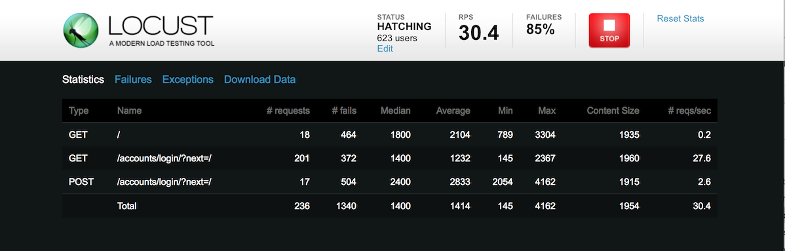
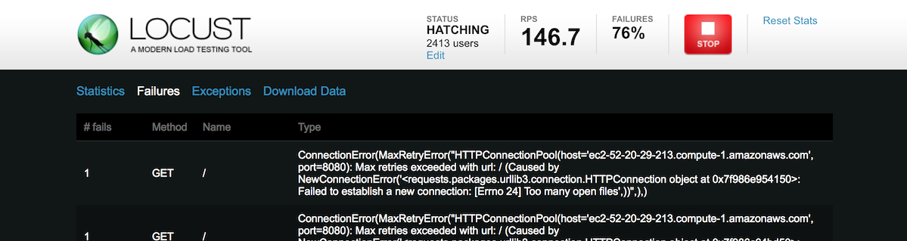
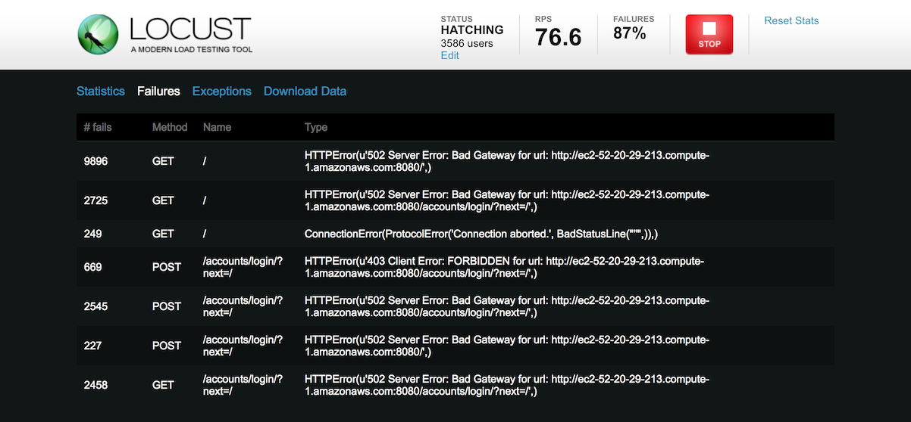

# Load Testing

We Load Test (apply simlulated load) a system to determine what the system's capacity is, what its failure modes are, and to determine if a system can handle a specified capacity.  Connected Device Systems are generally more complicated than, say, a database-backed website, and Load Testing them requires some different tools.

## Load Testing Web Sites

For websites, we think about the "load" as a number of concurrent users interacting with the system through a web browser.  As the number of concurrent users increases, the number of HTTP transactions per time interval generally increases.  Some web systems serve relatively static content (e.g., the a real estate property website), while others have highly dyanmic content, some or all of which is dependent on the user interacting with the system (e.g., Amazon Recommendations).  The overall system capacity (say, average HTTP transactions/second) is highly dependent on the servers, the software and frameworks, the database, architecture, etc.  Making changes to any or all of those components can increase the capacity and/or efficiency of the system.  Understanding what changes to make to increase capacity and/or efficiency, starts with data - understanding how the system currently functions, and experience.  

Generally, we want to Load Test a full-system, including all integrations and third party systems.  That is not always possible, though (for example, our third party systems may not have testing "sandboxes" that we can test against, and they may not allow load testing of their production systems (for good reason - load testing is explicitly designed to disrupt the system).  When third party systems cannot be load tested, you typically isolate your tests, or build stand-ins - simulated systems to take the place of the third party system(s).

## Simple Web Testing Scenario

To begin load testing you typically construct a scenario you want to load test, and then build a model to represent the system interactions that will represent that scenario. 

 For example, if you are preparing for a big launch of your new website, you and your sales and marketing team might determine that after a big marketing event you will have 45,000 users visiting your site within a 30 minute window, as a worst-case scenario (maximum load), and that each of those users will complete 4 criticals transactions in your flow (funnel):

1. GET "/" - the landing page
2. GET "/signup" - the signup page
3. POST "/signup" - submitting the signup page to create an account
4. GET "/user/welcome - welcome new user and provide overview of site/services

45,000 users x 4 transactions per user = 180,000 transactions

180,000 transactions in 30 minutes, is an average transactions rate of about 100 transactions per second.  We probably want to build some margin, so we may load test our system to 150% of that average load (150 transactions/sec).  Your marketing deparment may update the estimate to 90,000 users in the same period, and you might be load testing again, at a much higher number. 

When you load test, you apply a simulated traffic load based on your model to your site (preferably a separate environment from your Quality Assurance (QA) and your Production environments), and see how the site behaves under load.  Typically the load is ramped up over a period of time, so you can see how it functions at maybe 10%, 20%, ..., 90%, and 100% of the target load.  It might fail catastrophically at fraction of the target load, requiring the team to optimize and tune the site before starting testing again, and/or work with sales and marketing to re-validate the target load.

Clearly, not all transactions are equal.  For the example above, transaction #1 is presumably fast compared to transaction #3 - #1 does not require any authentication and the response content can probably be cached, while #3 requires several database operations.  

## **IMPORTANT:** Load Testing in AWS EC2

Cloud providers, like AWS EC2, can simplify load testing by allowing ad hoc deployment of systems-under-test _and_ load-generating-systems.  There can be some subtly, however.  For example, the `t2.micro` instances we have been using (and all `t2` instance types, for that matter) have variable performance characteristics (see [EC2 Instance Types](https://aws.amazon.com/ec2/instance-types/) and [Burstable Performance Instances](https://aws.amazon.com/ec2/instance-types/) to learn more about "CPU Credits" if you are curious).  That is fine for many applications.  For load-testing, however, it can cause wildly inconsistent results.

For this assignment it is important to use an EC2 Instance Type that has consistent characteristics.

**IMPORTANT: For this assignment, use `m5.large` instances for _both_ your NGINX/Django/Mosquitto instance _and_ your Locust Load Testing instance.**

`m5.large` instances **do not have a free tier** (they cost approximately $0.10/hour).  

You need two instances running simultaneously.  To avoid unnecessary costs, set the instance state to **Stop** when you are not using them, and then back to **Start** when you will use them.  Also, set up [AWS Billing Alerts](https://docs.aws.amazon.com/AmazonCloudWatch/latest/monitoring/monitor_estimated_charges_with_cloudwatch.html), as suggested earlier in the course to avoid unpleasant surprises.

**You are responsible for your AWS charges!** 

## Load Testing with Locust

There are many tools available for load testing web sites.  We will be using [Locust](http://locust.io/) an Open Source load testing tool, conveniently written in Python.

### System-Under-Test

Spin up a new Ubuntu `m5.large` instance and deploy our NGINX/Django/Mosquitto system there, using Ansible.

### Load Testing System

Let's generate a load against our Django instance. We'll need to generate a load on our server from another machine, so let's spin up another Ubuntu `m5.large` instance in EC2.

In AWS launch another Ubuntu LTS `m5.large` instance, and add a `Name` tag with a value of `locust` to help differentiate between your Django instance and your load testing instance.

**NOTE:** that this will go beyond free tier usage and incur a small charge so make sure you terminate this instance when you are done with the assignment to avoid unnecessary charges. 

We use `host$`, `cloud$`, and `lamp$` to denote bash prompts on those respective machines. For our load testing server we'll use `load$`.

Please refer to the [Locust Documentation](http://docs.locust.io/en/latest/) for more detailed information.

### Install Locust

Remote into your load testing server (NOT YOUR DJANGO INSTANCE). If you haven't already, let's upgrade our apt packages :

```bash
load$ sudo apt-get update
load$ sudo apt-get upgrade
```

Then remove system pip

```bash
load$ sudo apt-get purge python-pip python3-pip -y
load$ sudo apt-get autoremove -y
```

Then install pip, some dependencies, and then Locust.

```bash
load$ sudo apt-get install python3-distutils -y
load$ sudo wget https://bootstrap.pypa.io/get-pip.py
load$ sudo chmod +x get-pip.py
load$ sudo python3 get-pip.py
```

```bash
load$ sudo apt-get install -y python3-dev build-essential
load$ sudo pip3 install locustio
```

### Build a Simple "locustfile" Configuration File

Locust is configured with a Python file, called a [locustfile](http://docs.locust.io/en/latest/writing-a-locustfile.html).


The `client` in the file is stand-in for a web browser.  It can GET, POST, etc. URLs on a website.

Create a file called **locustfile.py**. Don't forget to replace {{USERNAME}} and {{PASSWORD}} with credentials for a user that can log into your Django website:

```python
from locust import HttpLocust, TaskSet, task


class UserBehavior(TaskSet):

    def on_start(self):
        self.login()

    def login(self):
        response = self.client.get("/login/?next=/")
        self.client.post("/login/?next=/", {"username": {{USERNAME}},
                                            "password": {{PASSWORD}} })

    @task(1)
    def load_page(self):
        self.client.get("/")

class WebsiteUser(HttpLocust):
    task_set = UserBehavior
    min_wait = 5000
    max_wait = 9000
```


This file specifies a [TaskSet](http://docs.locust.io/en/latest/writing-a-locustfile.html#taskset-class) with one task (a GET of "/").  We also specify an "on\_start()" method that will log our user in with the specified username and password _prior_ to starting the tasks in the task set.  The 'WebsiteUser' class will create a Locust `client` with that login behavior and repeatedly execute a random task from the TaskSet.  Since we only have one task defined, it will always run that task.  We have specified that our simulated user should pause a random time, between 5.0 and 9.0 seconds between tasks (in milliseconds), simulating a user clicking on link, viewing the resulting HTML, and then taking an action. **Note:** recent versions of Locust deprecate the `min_wait` and `max_wait` in favor of [`between`](https://docs.locust.io/en/stable/api.html#locust.wait_time.between).

The value `1` provided in the `@task()` decorator specifies a statistical weight for that task.  

A TaskSet with two tasks, like:

```python
    @task(3)
    def task1(self):
        pass

    @task(6)
    def task2(self):
        pass
```

with weights of "3" and "6" would result in two times as many executions of "task2" compared to "task1" during a Locust run (see [Weight Attributes](https://docs.locust.io/en/latest/writing-a-locustfile.html#the-weight-attribute)).

Save the file and start Locust with the file, setting the `host` argument to the base URL for your Django instance (e.g. --host=http://example.org). Also, do yourself a favor and open the host URL in your browser and double-check that your Django instance is still working and you can actually get to it.

```bash
load$ locust --host=http://{{django_server}}
```

You should see the Locust server start on port 8089 - Locust includes a light-weight HTTP interface, so you can initiate and monitor load testing in your browser. Go ahead an open that port up in the Security Group in AWS (same as how you did in earlier assignments) so you can access it.



Navigate to http://{{load_testing_server}}:8089. You should see something like the following page:



Let's start small -- emulate 100 users at a hatch rate of 1 per sec. Click **Start Swarming**. Wait a bit and you'll notice that the POST request is failing:



> If you are not seeing a count of failures, you might see that the `# requests` and `# fails` are zero for the `/login/` URLs.  Click on **Failures**.

Click the **Failures** tab:



You should see a 403 error. This is due to our POST getting rejected because we do not include a [CSRF token](https://en.wikipedia.org/wiki/Cross-site_request_forgery). Let's pull the token out of the original GET response and include it with our POST. Stop Locust running with CTRL+C in the `load$` SSH session and edit **locustfile.py**:

```python
[...]

    def login(self):
        response = self.client.get("/login/?next=/")
        csrftoken = response.cookies.get('csrftoken', '')
        self.client.post("/login/?next=/", {"csrfmiddlewaretoken": csrftoken,
                                            "username": {{USERNAME}},
                                            "password": {{PASSWORD}} })

[...]
```

> Note: our handling of the CSRF token here is specific to Django and might look a little different against, for example, a Rails server.

Run Locust again 

```bash
load$ locust --host=http://{{django_server}}
```

and navigate to the Locust page. Start testing again with 100 users at 1 per second. The POSTS should now be succeeding:



Stop the test and let's plug in something more interesting. Try 100,000 users & 100 per second. You should almost immediately see a slew of failures:



Examine the failures:



Note that this is not actually a failure from our Django server (although you may have some of those in there as well), but from Locust trying to open as many connections as we have asked it to. We are constrained by Python's default limit for open file descriptors (sockets), which in turn means we are limited by how many active TCP sockets we can have open.

Let's see how many we can open on this system. Run the following command:

```bash
python3 -c "import resource; print(resource.getrlimit(resource.RLIMIT_NOFILE))"
```

You should see some output like

```
(1024, 1048576)
```

These two numbers are the "soft limit" and "hard limit" (see [Python `getrlimit`](https://docs.python.org/3.5/library/resource.html#resource.getrlimit) and  [RLIMIT_NO_FILE](https://docs.python.org/3.5/library/resource.html#resource.RLIMIT_NOFILE)). The soft limit is the current limit in Python. The hard limit is the limitation of our OS environment. We can change the soft limit, but we cannot change it to a value higher than the hard limit (at least without some more complicated Linux Kernel parameter tweaking).

Let's edit our **locustfile.py** to set this a little higher:

```python
from locust import HttpLocust, TaskSet, task
import resource


resource.setrlimit(resource.RLIMIT_NOFILE, (999999, 999999))


class UserBehavior(TaskSet):
[...]
```

> To change resource limits we sometimes need superuser privileges.  If running locust throws a ValueError on `setrlimit`, run locust again but with sudo:

> ```bash
> load$ sudo locust --host={{http://django_server}}
> ```

Run the test again with 100,000 users at 100 users per second. You will still get failures, but not the failures you got earlier. These are [HTTP 502](https://developer.mozilla.org/en-US/docs/Web/HTTP/Status/502) errors, which means we are actually getting an internal error from our NGINX/Django web server (and not errors from Locust failing to create the requested number of connects).  You might remember that the HTTP 502 error can be returned by NGINX when it (acting as a "reverse proxy" or gateway) cannot establish a connection with the UWSGI Django server.

Possibly counterintuitively, that's good - we've overloaded the system!



We have a known breaking point for our server. It's easier to break than it needs to be -- with the right configuration changes, a `m5.large` could serve more concurrent requests than this. But this will be sufficient for our current needs.

> Note:  For real-world systems, you often need to scale up the computers generating the simulated load, to ones with more CPUs, faster network I/O, etc.  At some point, though, you start running out of "bigger" computers.  At that point, you need to scale "horizontally" - generating the load from a collection of computers working in tandem as a distributed load system.  Locust supports that (see [Running Locust distributed](https://docs.locust.io/en/latest/running-locust-distributed.html)), and it is straight-forward to scale it out, where one Locust instance coordinates the load (and the summary Web View and Control) across multiple "slave" instances.  Sometimes it is more cost-effective in a cloud environment to use a bunch of lower-end computers than one high-end computer.

Next up: [Load Testing MQTT](../12.2_Load_Testing_MQTT/README.md)

&copy; 2015-2022 LeanDog, Inc. and Nick Barendt
