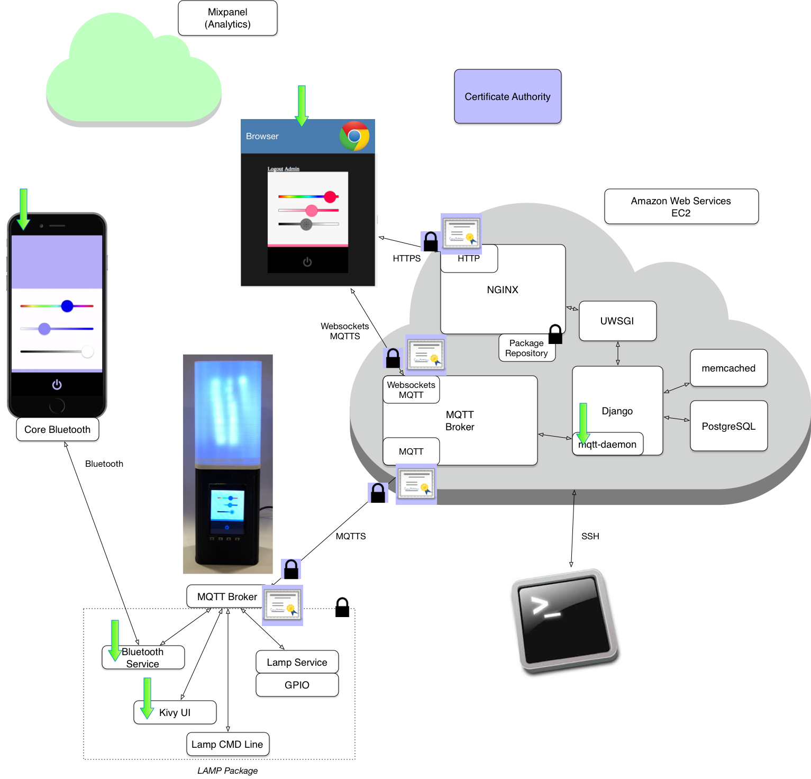
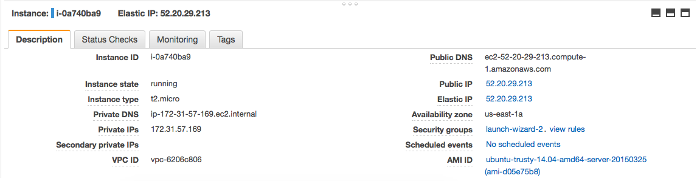

# Generate Certificates

So far this semester we have created a page that controls LAMPI and are serving it out of NGINX/Django. We have a user authentication scheme, although we're not putting it to great use just yet. Before we get there, we have a huge problem -- there is really no security to speak of anywhere in this system. Our MQTT bridging is insecure - all data is sent unencrypted over the network, and there is no authentication of the LAMPIs _or_ the cloud services (HTTP and MQTT). It would be trivial to sniff this communication and snoop on activity and/or inject malicious messages.

We have two paths into our EC2 server we need to secure -- the path from the lamp to the cloud, and the path from the user's browser back to the cloud. Rather than use username and password, we are going to use Transport Layer Security (TLS) to encrypt our communications. We will create our own local [Certificate Authority (CA)](https://en.wikipedia.org/wiki/Certificate_authority) which we will use to issue and sign certificates for both the lamp and web client. 

If you want to read more about how TLS (and it's predecessor SSL) work, [here is an excellent Stack Overflow post](http://security.stackexchange.com/questions/20803/how-does-ssl-tls-work).

## Where We are Going

In this chapter we will establish some basic authentication and end-to-end encryption with SSL/TLS.



## Generating the CA, CSR's, Certificates, Keys, etc.

For this assignment, use your EC2 instance to create the Certificate Authority (CA), Certificate Signing Requests, Certificates, Public/Private Keys, etc. and then distribute those credentials to the proper locations (e.g., some will stay on the EC2 server, some will need to be transferred to LAMPI, some will be needed on your computer, etc.).

## Acting as a (relatively insecure) Certificate Authority (CA)

We will be using OpenSSL to generate a Root Certificate for our CA (you can think of certificates connected together as a tree, with one certificate being the Root).  We will use that to sign other certificates directly. We will be signing directly with our Root certificate, and avoid using intermediate certs (intermediate certificates could increase the security of our CA, but at the cost of some additional complexity that is unneded within this course). If you want an idea of how to do this properly and securely, [this article](https://jamielinux.com/docs/openssl-certificate-authority/create-the-root-pair.html) is a  start.

### OpenSSL

[OpenSSL](https://www.openssl.org/) is a " robust, commercial-grade, and full-featured toolkit for the Transport Layer Security (TLS) and Secure Sockets Layer (SSL) protocols".

While it may be installed on your laptop or other computer, for creating your Certficate Authority use your Ubuntu EC2 instance (there are several different versions of OpenSSL in use, and varied system configurations, that can cause issues with the instructions below).


### Create the Root Certificate 

You can visualize certificates as forming a chain, in simple scenarios, or tree structure, in more complicated scenarios.  The "root" certificate sits at base of the tree or chain and is the core of a Certificate Authority's trust infrastructure.

Let's create the Root Certificate.  

**SSH to your EC2 instance** and create a directory to hold everything:

```bash
cloud$ cd ~
cloud$ mkdir ssl_certs
cloud$ cd ssl_certs
```

Now create the Root Certificate:

```bash
cloud$ openssl req -new -x509 -days 365 -extensions v3_ca -keyout lampi_ca.key -out lampi_ca.crt -sha256
```

Some notes about this command:

* **-x509** means the format of our key will be [X.509](https://en.wikipedia.org/wiki/X.509)
* **-days 365** means this certificate will expire in a year. Note that this means a year from now, LAMPI will stop being able to communicate to the cloud unless you issue new certificates.
* **-extensions v3_ca** means include the V3 CA configuration section
* **-keyout lampi_ca.key** means the Public/Private Key Pair will be created as lampi_ca.key.
* **-out lampi_ca.crt** means the certificate will be created as lampi_ca.crt.
* **-sha256** means use the SHA-2 algorithms, specifically SHA-256

You'll be prompted to enter a password. This is required. You'll need this password every time you use this Root key to sign other certificate requests.

You'll also be prompted for the following information. Feel free to change these, but keep the Common Name as something that will be unique to you. Do not leave them blank except, optionally, for the Organizational Unit Name.

```bash
Country Name (2 letter code) [AU]:US
State or Province Name (full name) [Some-State]:Ohio
Locality Name (eg, city) []:Cleveland
Organization Name (eg, company) [Internet Widgits Pty Ltd]:CWRU
Organizational Unit Name (eg, section) []:
Common Name (e.g. server FQDN or YOUR name) []:{your_name}.lampi_ca
Email Address []:{your_email_address}
```

**NOTE: keeping the Private Key secret and secure is the most critical aspect of running a secure Certficate Authority.**

### Create the server certificate

Next we will make a certificate for our EC2 server. This will be used for serving our webpage (HTTPS), and MQTT (the standard MQTT protocol as well as MQTT over websockets).  This will be a "derived" certificate, in that we will use the Root Certificate we created above to cryptographically sign this new certificate - the first "link" or "branch" in our CA infrastructure "chain" or "tree".

This is a multi-step process:

1.  Identify the **Common Name** for the entity that the certificate will be used to securely authenticate.
2.  Generate a Public/Private Key Pair
3.  Generate a Certificate Signing Request (CSR)
4.  Generate a Signed Certificate from the CSR
5.  Install the Certificate and Private Key

#### Identify the **Common Name**

First we will need our fully Qualified Domain Name (FQDN) - this is the **Common Name** (or abbreviated as **CN**) of the certificate. Navigate to **console.aws.amazon.com** and click on **EC2**. Then, click on **Instances** on the left and select your instance. Once you do that, lower on the screen you should see information about that instance. Look for **Public DNS** and note the Fully Qualified Domain Name (FQDN) value that you see (i.e. `ec2-52-20-84-204.compute-1.amazonaws.com`). 

You will need to use the FQDN as the **Common Name** of the server certificate.

**NOTE: you _must_ use the Public DNS Hostname of your instance for the __Common Name__**.  Do not use the IP address.



#### Create Public/Private Key Pair

First, generate the public & private key pair for the server certificate.

```bash
cloud$ openssl genrsa -out lampi_server.key 2048
```

Some notes about this command:

* **genrsa** means we're generating an RSA Public/Private key pair
* **2048** the length of the key in bits

#### Create the Certificate Signing Request (CSR)

Next, you need to create the CSR ([Certificate Signing Request](https://en.wikipedia.org/wiki/Certificate_signing_request)). This will contain information about your server (critically, the **Common Name** and **SubjectAltName**, which are the same), and will serve as the basis for the certificate we will generate.

Changes with Browser Security in the past few years have changed what particular Browsers require in certificates.  For example, Chrome began requiring that the DNS hostname appear in the **SubjectAltName** field (see [here](https://textslashplain.com/2017/03/10/chrome-deprecates-subject-cn-matching/) for example).  Putting a value into the **SubjectAltName** requires using a configuration file with OpenSSL.  Save the following as **openssl.conf** and replace the `{FILL IN FQDN HERE}` with your **FQDN** from above:

```
[req]
distinguished_name = req_distinguished_name
req_extensions = v3_req

[req_distinguished_name]
countryName = Country Name (2 letter code)
countryName_default = US
localityName = Locality Name (eg, city)
organizationalUnitName = Organizational Unit Name (eg, section)
commonName = Common Name (eg, YOUR name)
commonName_max = 64
emailAddress = Email Address
emailAddress_max = 40

[v3_req]
keyUsage = nonRepudiation, digitalSignature, keyEncipherment, dataEncipherment
extendedKeyUsage = serverAuth
subjectAltName = @alt_names

[alt_names]
DNS.1   = {FILL IN FQDN HERE}

[ CA_default ]
copy_extensions = copy
```

Then invoke `openssl` to create the CSR, specifying the configuration file to use:

```bash
cloud$ openssl req -out lampi_server.csr -key lampi_server.key -new -config openssl.conf -sha256
```

**NOTE:** the `-sha256` is important for another security change browsers are enforcing (deprecating the default, insecure SHA-1 hash).

You'll be prompted for several pieces of information - it will look something like the following. Feel free to change these, but the Common Name must be the **FQDN** of your EC2 instance that we looked at earlier. **Leave the challenge password blank.** The Organizational Unit Name and Company Name are optional, but fill out the rest.

```bash
Country Name (2 letter code) [AU]:US
State or Province Name (full name) [Some-State]:Ohio
Locality Name (eg, city) []:Cleveland
Organization Name (eg, company) [Internet Widgits Pty Ltd]:CWRU
Organizational Unit Name (eg, section) []:
Common Name (e.g. server FQDN or YOUR name) []: {FILL IN FQDN HERE}
Email Address []:{your_email_address}

Please enter the following 'extra' attributes
to be sent with your certificate request
A challenge password []:
An optional company name []:
```

You can output the CSR in a human-readable format like so:

```
cloud$ openssl req -in lampi_server.csr -noout -text
```

#### Creating the Certificate

Lastly, we need to use the CSR to create the TLS Certificate based on the CA Root Public/Private Key pair we initially created.

If we were purchasing a Certificate from a commercial CA, we would send the CSR to the CA, go through a process to verify our identity (or our organization's identity) with the CA, and then the CA would send us back a Certificate (created with the CA's Root Certificate and Public/Private Key Pair, and our CSR).  Since we are acting as our own CA, we will generate the Certificate directly.

```bash
cloud$ openssl x509 -req -in lampi_server.csr -CA lampi_ca.crt -CAkey lampi_ca.key -CAcreateserial -out lampi_server.crt -days 365 -sha256  -extfile openssl.conf -extensions v3_req
```

Some notes about this command:

* **-req** X.509 Certificate Signing Request (CSR) Management
* **-in** the filename of the Certificate Signing Requesk
* **-CA** the filename of the Certificate Authority's SSL/TLS certificate we generated earlier
* **-CAkey** the filename of the Certificate Authority's Public & Private key pair
* **-CAcreateserial** with this option the CA serial number file is created if it does not exist: it will contain the serial number "02" and the certificate being signed will have the 1 as its serial number. If the -CA option is specified and the serial number file does not exist a random number is generated
* **-out** the filename of the generated Server SSL/TLS Certificate
* **-days 365** means this certificate will expire in a year. Note that this means a year from now, LAMPI will stop being able to communicate to the cloud unless you issue new certificates.

You'll be prompted for the CA key's passphrase that you created initially. Once you provide the password, the TLS certificate will be created based off of the contents of the CSR.

### Create the client certificate

Let's create the client certificate. This certificate will be used to authenticate the Raspberry Pi MQTT broker on LAMPI to the EC2 cloud MQTT Broker.

Client certificates are relatively rare.  Typically, Web Server's have a certificate, so browsers and browser users can verify (authenticate) that the server is legitimate.  The Web Server generally allows any client to connect to it, possibly requiring users to authenticate at some point with a username/password (like our NGINX/Django site).  Unfortunately, usernames and passwords provide less than ideal security in many circumstances, and are harder to manage.

To secure our MQTT communications between the LAMPI devices and the Mosquitto broker in EC2, we will embed a unique client certificate in each device.  Since both the LAMPI and Mosquitto broker are under our control, we can provide our CA Certificate to both, allowing them to mutually authenticate.  This provides highly secure authentication _and_ a secure, encrypted channel for communication.

First, we need to get the clientid name that we used in the MQTT bridging configuration - this will be used as the **Common Name** in the certificate.  Open **/etc/mosquitto/conf.d/lampi_bridge.conf** and find the value for **remote_clientid**. You can output the file contents easily using `cat`:

```bash
lamp$ cat /etc/mosquitto/conf.d/lampi_bridge.conf
```

The value of the **remote_clientid** (something like ```b827eb74663e_broker```) will be used as the Common Name for the client certificate we are going to create.

Like the server, let's start by generating the private / public keys:

```bash
lamp$ openssl genrsa -out b827eb74663e_broker.key 2048
```

Next, you need to create the CSR ([Certificate Signing Request](https://en.wikipedia.org/wiki/Certificate_signing_request)). This will contain information about your client in the TLS response.

```bash
lamp$ openssl req -out b827eb74663e_broker.csr -key b827eb74663e_broker.key -new
```

You'll be prompted for the following information. Feel free to change these, but the Common Name must be the **remote_clientid** of the configured MQTT bridging connection that we looked at earlier. **Leave the challenge password blank**. Fill out the rest, except for the optional Company Name and Organizational Unit Name.

```bash
Country Name (2 letter code) [AU]:US
State or Province Name (full name) [Some-State]:Ohio
Locality Name (eg, city) []:Cleveland
Organization Name (eg, company) [Internet Widgits Pty Ltd]:CWRU
Organizational Unit Name (eg, section) []:
Common Name (e.g. server FQDN or YOUR name) []:b827eb74663e_broker
Email Address []:{your_email_address}

Please enter the following 'extra' attributes
to be sent with your certificate request
A challenge password []:
An optional company name []:
```

You will need to transfer the CSR to your EC2 instance (e.g., using `scp`), generate the certificate using the CA, and then transfer the certificate back to the LAMPI (again, likely using `scp`).

We will fulfil the signing request based on the CA's public and private key pair we initially created.

```bash
cloud$ openssl x509 -req -in b827eb74663e_broker.csr -CA lampi_ca.crt -CAkey lampi_ca.key -CAcreateserial -out b827eb74663e_broker.crt -days 365 -sha256  -extfile openssl.conf -extensions v3_req
```

The parameters are the same as for the Server SSL/TLS certificate with the exception of different filenames. You'll be prompted for the CA key's password that you created initially. Once you provide the password, the TLS certificate will be created based off of the contents of the CSR.


You can verify that a certificate is valid and derived from a particular CA cerficate using the `verify` subcommand of openssl:

```bash
cloud$ openssl verify -CAfile lampi_ca.crt b827eb74663e_broker.crt
b827eb74663e_broker.crt: OK
```

If there is an error, you will not see `OK`.

Be sure your client certificate is transferred back to your LAMPI after creating it on your EC2 instance.

Next up: [13.2 Secure Client Bridging](../13.2_Secure_Client_Bridging/README.md)

&copy; 2015-2022 LeanDog, Inc. and Nick Barendt
