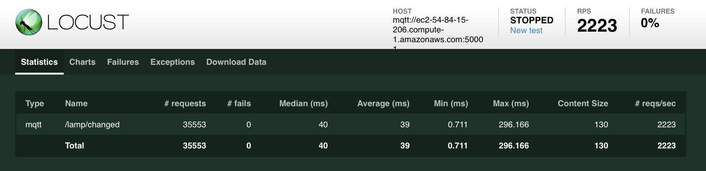

# Instructor Load Testing Notes

Some results and notes on load testing HTTP and MQTT.

## HTTP

**NOTE: all HTTP tests used a hatch rate of 10 users per second.**

### Baseline

For a baseline, working with the Web service as delivered for Chapter 12 (NGINX, uWSGI, Django, sqlite), the system could support approximately **400 simulated users** without failures:


with an aggregate transaction rate of approximately **54 Requests Per Second**.


From charts we can see that while the number of users is increasing linearly the average response time seems to be increasing at much faster rate as we approach 400 concurrent users.  Monitoring the CPU on the System Under Test (SUT) shows that it was operating at close to 100% utilization.


### Increasing Capacity - Enabling Caching and PostgreSQL

A few quick and easy Django and database changes were made:

* installed [memcached](https://memcached.org/) a popular and robust memory object caching system
* configured Django to cache [sessions](https://docs.djangoproject.com/en/1.10/topics/http/sessions/#using-cached-sessions)
* configuring Django to cache the entire lampisite with the [per-site cache middleware](https://docs.djangoproject.com/en/1.10/topics/cache/#the-per-site-cache)
* installed [PostgreSQL](https://www.postgresql.org/)
* configured [Django to use PostgreSQL](https://docs.djangoproject.com/en/1.10/ref/contrib/postgres/)
* configured [Django to re-use database connections](https://docs.djangoproject.com/en/1.10/ref/settings/#conn-max-age)

Running the new configuration with **400 simulated users**:


Looking at the charts:


we can see that the average response never exceeds approximately 60 ms, and is decreasing as new users are being added, and then it drops dramatically after the target level of 400 users is hit (essentially everthing is being served directly from the in-memory cache at this point.)

How much higher can we go?

Here is data with **1,000 simulated users**:


The charts show that we are hitting some limits:


The red lines show performance at 1000 users.  Average response time is shooting up at that point.  The yellow line shows approximately where we start to see the slope of the line increase, from ~500 users.  From that point up to maybe 800 or 900 users, the system is behaving reasonably well, but then response times climb into the 300ms or longer.

#### Summary

From a baseline capacity of ~400 users, the introduction of a few relatively straight-forward configuration changes at least doubled the system's capacity to 800 users or more.

As a reminder, what is a reasonable capacity, what configuration changes or site optimizations are appropriate, etc. are all _highly application dependent_.


## MQTT

### Model

While the devices publish a variety of messages (`lamp/changed`, `lamp/connection/+/state`, `/lamp/bluetooth`), only the messages published on `lamp/changed` are published with any real frequency through the MQTT bridge to EC2.  For load testing, we can ignore the other topics/messages and just focus on `/lamp/changed`.

### locustfile

We can say that our worst-case behavior is a malicious user continuously touching/dragging the Kivy UI, pausing for a short time (maybe 1-2 seconds) between interactions.  Each time they touch/drag the Kivy UI, we will assume they generate 10 messages on `/lamp/changed` that need to be sent the Mosquitto broker in EC2 as a side-effect.


A locust file might look something like this to simulate this load:

```python
import json
import random
import resource

from locust import TaskSet, task

from mqtt_locust import MQTTLocust

resource.setrlimit(resource.RLIMIT_NOFILE, (999999, 999999))

TIMEOUT = 0.5      # put pretty tight time constraints on message ACK
REPEAT_COUNT = 10  # we will assume we get a burst of messages whenever user
                   #   interacts with touchscreen

# topics and QoS
# 'lamp/set_config' 1
# 'lamp/changed' 1
#     lots of messages when user drags slider, not many for on/off
#
# 'lamp/connection/+/state' 1
#    not very many messages
#    topics:
#      'lamp/connection/lamp_service/state'
#      'lamp/connection/lamp_ui/state'
#      'lamp/connection/lamp_bt_peripheral/state'
#    '0' or '1'
#
# 'lamp/bluetooth' 1
#     only generates messages when bluetooth device connected
#     when connected, generates a message every second
#     { 'client': client_address, 'rssi': <integer>}

# for loadtesting purposes, we can ignore messages to the
#   'lamp/connection/+/state' and 'lamp/bluetooth' topics
#   - their frequency is so low as to be neglible

MAX_DEVICE = 10000
DEVICE_ID_BASE = 0x1e0000000000


class MyTaskSet(TaskSet):

    def on_start(self):
        self.device_id = DEVICE_ID_BASE + random.randint(0, MAX_DEVICE-1)

    def _generate_bridged_topic(self, device_topic):
        return 'devices/{}{}'.format(self.device_id, device_topic)


    @task(1)
    def lamp_changed(self):
        # from the bridge perspective, publishing lamp changed notifications
        # from the LAMPI to the EC2 infrastructure probably worst case load
        self.client.publish(
                self._generate_bridged_topic('lamp/changed'),
                self.payload(),
                qos=1,
                timeout=TIMEOUT,
                repeat=REPEAT_COUNT,
                name='lamp/changed'
                )

    def payload(self):
        payload = {
            'on': random.choice(['true', 'false']),
            'color': {
                'h': random.random(),
                's': random.random(),
            },
            'brightness': random.random(),
            'client': 'locust',
        }
        return json.dumps(payload)


class MyLocust(MQTTLocust):
    task_set = MyTaskSet
    # we assume, worst-case, that a user drags a slider, and then
    #   waits 1-2 seconds before doing another operation
    min_wait = 1000
    max_wait = 2000
```


## MQTT Results

NOTE:  all MQTT tests used a hatch rate of 100 users ("devices") per second.  Since each "user" has very little set up overhead (compared to our HTTP users that need to authenticate), we can hatch our MQTT users faster without causing issues.

The Mosquitto Broker could handle approximately **700 Simulated Devices** (**2,200 Requests Per Second** with an averager response time of ~40ms):




That is about its limit.

And, if we attempt to load beyond that (say, 1000 users):


we can see that the Average Response Time is increasing slowly beyond ~700 users, and appears to be increasing more rapidly past ~1,000 users (there are likely some artifacts of locsust testing in the graphs, though, too, particularly the reset of statistics when the target number of users are reached).


